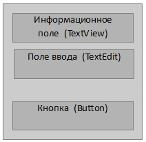
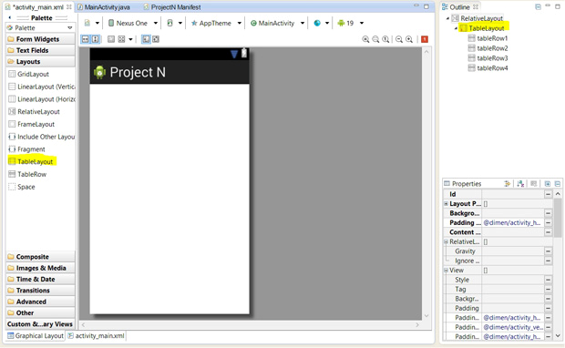
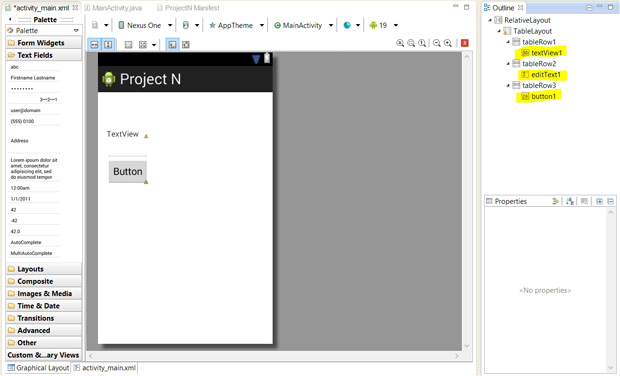
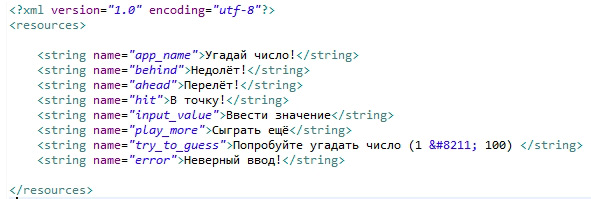
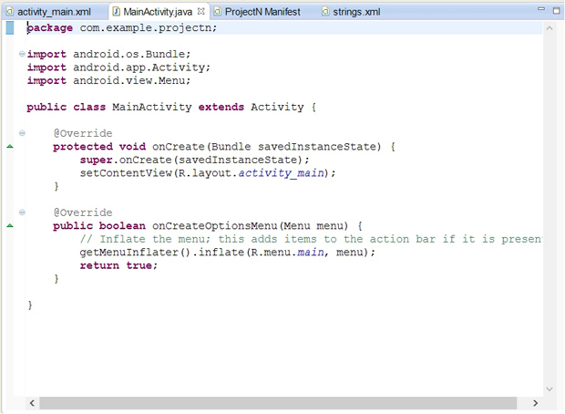
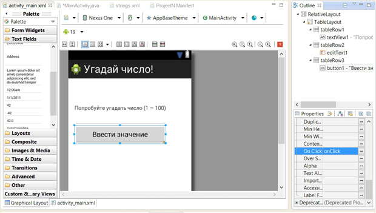

# Mobile-development

## Практика студентов Финансового университета

# Java Android Studio
__________________________________________

# [Методичка](http://koroteev.site/md/)

- # Угадай число
Цель работы

    Разработка простого приложения, помогающего понять структуру приложения, освоить основные операторы, привыкнуть к среде разработки.

## Задания для выполнения

Наше будущее приложение  - "Угадай число". 
Суть приложения в том, что программа случайным образом "загадывает" число от 0 до 100, а пользователь должен угадать это число. 

При каждом вводе числа, программа сообщает пользователю результат: введенное число больше загаданного, меньше или же "Ура, победа!" число угадано.

Разрабатываемое приложение выполняет свои функции только когда видимо на экране, когда оно не видимо его работа приостанавливается, т. е. имеем дело с приложением переднего плана. Для выполнения всей работы достаточно определить одну активность в приложении, фоновые процессы не предусмотрены.

Далее в работе рассмотрим простейшие элементы интерфейса пользователя и добавим их в приложение, а также рассмотрим вопросы, связанные непосредственно с программированием: научимся обрабатывать события, возникающие при взаимодействии приложения с пользователем; реализуем логику проверки числа на совпадение с загаданным.

- ## Создание приложения и изучение его структуры

Создайте новый проект. 

В процессе создания проекта, среда разработки подготавливает необходимые папки и файлы. Полный иерархический список обязательных элементов проекта можно увидеть на вкладке Package Explorer

В настоящее время нас будет интересовать назначение нескольких файлов и папок.
### Рассмотрим папки:

•	папка src - содержит файлы с исходным кодом на языке Java. Именно в этой папке размещаются все классы, создаваемые в процессе разработки приложения. Сейчас в этой папке в пакете com.example.projectn размещается единственный класс MainActivity.java. Этот класс определяет главную и единственную активность в этом приложении.
- 1: Имя пакету присваивается в процессе создания приложения в поле Package Name, использовать com.example не рекомендуется, т. к. пакет с таким именем нельзя загрузить в Google Play. Часто рекомендуют использовать в качестве имени пакета название сайта программиста, записанное в обратном порядке, можно просто использовать свои имя и фамилию. Последнее слово в имени пакета формируется автоматически и совпадает с именем проекта.
- 2: Имя файлу присваивается в процессе создания приложения на этапе настройки активности. Имя определяется в поле Activity Name.
- 3: Package Explorer отображает структуру папок, которая создается в каталоге, выбранном в качестве рабочего (Workspace) при запуске Eclipse. Например, рабочий каталог называется workspace, в нем для нашего проекта появилась папка с именем проет, в ней есть папка src, в ней com, в ней example, в ней projectn (заметьте, что название пакета распалось на три папки, каждое слово, отделенное точкой определило новую папку). И уже в папке projectn находится файл MainActivity.java и будут размещаться другие java-файлы проекта.

•	папка res - содержит структуру папок ресурсов приложения, рассмотрим некоторые из них:

-	layout - в данной папке содержатся xml-файлы, которые описывают внешний вид форм и их элементов, пока там находится только activity_main.xml;
-	values - содержит XML файлы, которые определяют простые значения, таких ресурсов как, строки, числа, цвета, темы, стили, которые можно использовать в данном проекте;
-	menu - содержит XML файлы, которые определяют все меню приложения.
Подробно с описанием всех элементов файла манифеста приложения можно познакомиться по ссылке:
http://developer.android.com/guide/topics/manifest/manifest-intro.html.

Чаще всего, при создании приложения приходится иметь дело с папками src, res/layout и res/values, т.к. там находятся основные файлы проекта.

## Настройка интерфейса приложения
Пришло время задуматься о внешнем виде приложения. Для начала необходимо определить какие элементы графического интерфейса нам нужны, как эти элементы будут располагаться на форме и каким образом будет реализовано взаимодействие с пользователем.

Так как приложение очень простое, то и интерфейс особой сложностью отличаться не будет. Нам потребуется поле для ввода чисел (TextEdit), текстовая метка для вывода информации (TextView) и кнопка для подтверждения введенного числа (Button). Располагать элементы интерфейса будем друг под другом, сверху информационная часть, ниже поле ввода, кнопку разместим в самом низу приложения. Взаимодействие приложения с пользователем организуется очень просто: пользователь вводит число в поле для ввода и нажимает кнопку, читает результат в информационном поле и, либо радуется победе, либо вводит новое число.

Если пользователь вводит правильное число, то приложение предлагает ему сыграть снова при этом кнопка будет играть роль подтверждения, а в информационное поле будет выведено приглашение к повторной игре.

Схематично интерфейс приложения изображен на рисунке:

Нам необходимо добавить на форму три элемента: 
    
    информационное поле (TextView), 
    поле ввода (TextEdit) 
    и кнопку (Button).

Android IDE поддерживает два способа для выполнения действий по формированию интерфейса приложения: первый основан на XML-разметке, второй относится к визуальному программированию и позволяет перетаскивать объекты интерфейса и размещать их на форме с помощью мыши. Считается, что визуальный способ подходит для новичков, а более продвинутые разработчики могут писать код вручную, однако чаще всего используется комбинированный подход.

Для формирования интерфейса будем работать с файлом res/layout/activity_main.xml. На рисунке можно увидеть редактор, соответствующий визуальному способу формирования интерфейса, этому режиму соответствует вкладка Graphical Layout.

Зададим табличное расположение компонентов на форме, для этого выберем вкладку Layouts, найдем там TableLayout и добавим его на форму:

Настройка интерфейса, добавление TableLayout

Теперь начнем добавлять элементы интерфейса, будем использовать графический режим правки.

- Во-первых, нам необходимо добавить информационное поле. Для этого на панели =Palette=  найдем поле TextView, перенесем в окно приложения, разместим в первой строке таблицы (TableLayout).

- Во-вторых, нам потребуется поле ввода информации, на вкладке Text найдем текстовое поле Number и разместим во второй строке таблицы.

- В-третьих, вернемся на вкладку Buttons, выберем там элемент Button и добавим в третью строку таблицы. Ненужную четвертую строку таблицы удалим, получим следующий вид приложения.

Интерфейс приложения

После настройки интерфейса можно заглянуть в файл activity_main.xml, в этом файле прописано, что используется TableLayout и дано описание каждой из трех строк. На рисунке можно увидеть, как выглядит такое описание на примере первой строки таблицы.

Фрагмент файла activity_main.xml, описание строки в TableLayout

Теперь необходимо наполнить наши элементы интерфейса смыслом, нам понадобится текст для общения с пользователем, при программировании под Android существует практика разделять ресурсы и код приложения. 

Для хранения любых строк, которые могут понадобиться приложению, используется файл strings.xml. Хранение всех строковых ресурсов в этом файле серьезно облегчает локализацию приложения на другие языки. Этот файл можно найти в Package Explorer в папке res/values. Откроем его и посмотрим, что там есть.

Файл string.xml

Уберем лишние строки и добавим новые.

Отредактированный файл string.xml

Данные переменные будут выполнять следующие задачи:

app_name установит "видимое" название приложения;

behind, ahead, hit оповестят пользователя об его успехах в игре;

play_more и try_to_guess установит название кнопки, которое объяснит её функции;

input_value пригласит пользователя к вводу числа;
error сообщит о неверном вводе.

После изменения strings.xml, при переходе на другую вкладку, не забудьте сохранить изменения (самый быстрый способ - нажать Ctrl+S).

Настроим текст в информационном поле. 
Для этого на вкладке Properties в правой части окна выберем элемент textView1 (это и есть наше информационное поле, имеет смысл придумать ему более осмысленное имя). Найдем свойство Text, подставим в него значение строки с именем try_to_guess.

Аналогично можно настроить текст, которым нас будет приветствовать кнопка, только в этом случае надо работать с элементом button1.

Настройка текста для кнопки button1

Пришло время вспомнить о виртуальном устройстве, если оно работает, уже можно запустить проект и посмотреть, как приложение будет выглядеть на экране устройства, а выглядеть оно может так.

Запуск приложения на виртуальном устройстве

Приложение выглядит довольно просто, но мы на многое и не рассчитывали. 
Главное, что нас интересует, это наличие всех элементов на экране, верный текст в каждом элементе, где он предусмотрен и возможность вводить числа в поле ввода. 

На рисунке видно, что все требования выполнены. 
Приложение есть, его можно запустить на виртуальном или реальном устройстве, но оно ничего не делает. Следующим шагом будет реализация логики приложения, т. е. обработка события нажатия на кнопку, как было прописано в задании.

## Реализация логики приложения

Приступим непосредственно к программированию, работать будем с файлом src/com.example.projectn/MainActivity.java. Найдем этот файл в Package Explorer, откроем и начнем редактировать.

Рис. 4.13. Файл MainActivity.java в Package Explorer
Пока файл выглядит следующим образом.

Файл MainActivity.java после создания приложения

Можно заметить, что класс MainActivity является наследником класса Activity и в нем уже реализован метод onCreate(), который запускается при первоначальном создании активности, нам потребуется его дополнить, но об этом чуть позже.

Мы предполагаем программно менять информацию в поле TextView, получать значение из поля EditText и обрабатывать события нажатия на кнопку Button, поэтому необходимо объявить соответствующие переменные, как поля класса MainActivity:

    TextView tvInfo;
    EditText etInput;
    Button bControl;	

Чтобы не было ошибок, необходимо импортировать пакет android.widget, который содержит все элементы графического интерфейса:

    import android.widget.*;	

На самом деле среда разработки подскажет, что делать.

Теперь необходимо связать эти переменные с элементами интерфейса, уже добавленными нами в activity_main.xml, сделать это необходимо в методе onCreate(), а для получения уже созданного элемента интерфейса воспользуемся методом findViewById().
 Итак в метод onCreate() добавим следующие строки:

    tvInfo = (TextView)findViewById(R.id.textView1);
    etInput = (EditText)findViewById(R.id.editText1);
    bControl = (Button)findViewById(R.id.button1);	

Метод findViewById() возвращает объект класса View, который является общим предком для всех компонентов пользовательского интерфейса, для того чтобы избежать возможных ошибок в скобках перед вызовом метода указываем до какого конкретно компонента необходимо сузить возможности объекта View.

Пришло время выполнить обработку нажатия на кнопку. Вернемся к файлу activity_main.xml в графический режим редактирования, выберем элемент Button и на вкладке со свойствами элемента найдем свойство On Click и запишем в него onClick - имя метода, который будет обрабатывать нажатие на кнопку. 

Настройка свойства On Click для кнопки
Эти же действия можно выполнить в фале activity_main.xml, достаточно дописать выделенную строку:

Для настройки свойств элементов интерфейса достаточно использовать любой способ: графический или редактирование XML файла.

Вернемся в файл MainActivity.java, в класс активности необходимо добавить метод:

    public void onClick(View v){...}	

Имя метода не обязательно должно быть onClick(), главное, чтобы оно совпадало с именем, указанным в свойстве On Click. В этом методе и будет происходить все наше программирование в этой лабораторной работе.

Нам потребуются две переменные:
целочисленная для хранения загаданного числа (случайное число от 1 до 100);
логическая для хранения состояния закончена игра или нет.
Обе эти переменные имеет смысл объявить как поля класса активности, первоначальные значения присвоить в методе onCreate.

Получить целочисленное значение из поля ввода, можно с помощью следующей конструкции:

    Integer.parseInt(etInput.getText().toString());

изменить значение текста в информационном поле можно с помощью следующей конструкции:

    tvInfo.setText(getResources().getString(R.string.ahead));	

в данном случае в информационном поле появится значение строкового ресурса с именем ahead.

Осталось реализовать логику приложения в методе onClick(). 
Предлагаем написать код этого метода самостоятельно.
## Дополнительные задания
Обработать возможность нажатия кнопки до ввода числа. Необходимо предусмотреть этот вариант и адекватно среагировать.

Обработать возможность ввода пользователем числа вне данного диапазона. Необходимо вывести сообщение пользователю и запросить повторный ввод.

Предусмотреть возможность выхода из приложения.

(*) Реализовать возможность выбора нескольких уровней сложности.

- # Простой калькулятор		

[Видео](https://www.youtube.com/watch?v=ur63IBa4rwg)

