# Mobile-development


## Практика студентов Финансового университета


# Java Android Studio
__________________________________________

# [Методичка](http://koroteev.site/md/)


- # Создание второго окна приложения
Цель работы

    Ознакомиться со способом создания и запуска второго окна в составе мобильного приложения. 
## Методические указания
Создадим новый проект. По умолчанию, новый проект состоит из одной активити с пустым расположением. 

Во-первых, создадим расположение, состоящее из одной кнопки. При нажатии на эту кнопку мы будем переходить во второе окно приложения:

```xml
<?xml version="1.0" encoding="utf-8"?>
<LinearLayout
   xmlns:android="http://schemas.android.com/apk/res/android"
   android:orientation="vertical"
   android:layout_width="fill_parent"
   android:layout_height="fill_parent">
   <Button
       android:layout_width="wrap_content"
       android:layout_height="wrap_content"
       android:text="Go to Activity Two"
       android:id="@+id/btnActTwo">
   </Button>
</LinearLayout>
```

Создадим для этой кнопки обработчик нажатия, пока пустой:

```java
@Override
public void onClick(View v) {
   switch (v.getId()) {
       case R.id.btnActTwo:
           // TODO Call second activity
           break;
       default:
           break;
   }
}
```

Теперь попробуем добавить новую активити. Самый простой способ это сделать - щелкнуть на проекте в панели навигатора правой кнопкой и выбрать пункт меню 

*New -> Activity -> Empty Activity,*

как показано на рисунке:


Мы должны увидеть окно добавления нового окна (активити), которое весьма похоже на окно, появляющееся при создании нового проекта. Здесь мы можем ввести имя нашего нового компонента, имя файла с расположением элементов и некоторые другие параметры. Преимуществом этого способа создания новой активити является то, что студия автоматизирует весь процесс за нас, создает все необходимые файлы и вносит нужные дополнения в файл манифеста. 

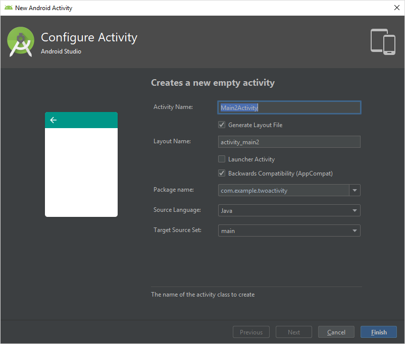

При нажатии на кнопку Finish мы должны увидеть два новых файла в нашем проекте - один с программным кодом и один с XML расположением. Обратите внимание, что оба окна приложения, несмотря на то, что являются независимыми компонентами приложения, существуют в одном адресном пространстве. 

Обратите внимание на то, что в файле манифеста появилась новая строка:

``<activity android:name=".ActivityTwo"></activity>``

То есть, наша новая активити полноценно зарегистрирована в нашем приложении.
Теперь для иллюстрации создадим расположение второго окна. Создадим в нем одно текстовое поле:

```xml
<LinearLayout
   xmlns:android="http://schemas.android.com/apk/res/android"
   android:orientation="vertical"
   android:layout_width="match_parent"
   android:layout_height="match_parent">
   <TextView
       android:id="@+id/textView1"
       android:layout_width="wrap_content"
       android:layout_height="wrap_content"
       android:text="This is Activity Two">
   </TextView>
</LinearLayout>
```

Теперь для организации перехода в новое окно нам осталось дописать в обработчике тапа по кнопке создание интента и запуск активити. В данном случае воспользуемся явным вызовом - передадим в интент конкретное название только что созданной активити:

```java
public void onClick(View v) {
   switch (v.getId()) {
       case R.id.btnActTwo:
           Intent intent = new Intent(this, ActivityTwo.class);
           startActivity(intent);
           break;
       default:
           break;
   }
}
```

Регистрацию обработчика тапа оставляем на самостоятельную реализацию.

Теперь при запуске приложения мы должны иметь возможность перейти в новое окно по тапе на кнопке. Обратите внимание, что для возврата к предыдущему окну нам можно воспользоваться стандартной кнопкой Назад. 
Для того, чтобы лучше понять жизненный цикл активности давайте добавим в наше основное окно реализации некоторых стандартных методов жизненного цикла:

```java
@Override
protected void onStart() {
   super.onStart();
   Log.d(TAG, "MainActivity: onStart()");
}

@Override
protected void onResume() {
   super.onResume();
   Log.d(TAG, "MainActivity: onResume()");
}

@Override
protected void onPause() {
   super.onPause();
   Log.d(TAG, "MainActivity: onPause()");
}

@Override
protected void onStop() {
   super.onStop();
   Log.d(TAG, "MainActivity: onStop()");
}

@Override
protected void onDestroy() {
   super.onDestroy();
   Log.d(TAG, "MainActivity: onDestroy()");
}

@Override
   protected void onRestart() {
       super.onRestart();
       Log.d(TAG, "MainActivity: onRestart()");
}
```

Эти методы, как Вы помните, вызываются автоматически системой при смене состояния активности, например, при приостановке активности. В данном случае, мы в каждом из этих методов пишем в поток логов специальное сообщение, поясняющее, какой метод когда был вызван. Первый аргумент, это просто метка, позволяющая в общем потоке методов выделить созданные нами сообщения:

``final String TAG = "States";``

Так как метод onCreate также относится к методам жизненного цикла, добавим соответствующее сообщение и в него:

``Log.d(TAG, "MainActivity: onCreate()");``

Для более полной информации можете самостоятельно добавить соответствующие сообщения во вторую активити.
Теперь запустим наше приложение и убедимся, что все работает, как нужно:


Мы можем посмотреть диагностические сообщения, которые посылает и сама система, и студия, и непосредственно наше приложение в окне Logcat студии. Для удобства отфильтруем сообщения по нашей метке States:


Теперь вы знаете, как создавать и вызывать новое окно в составе вашего приложения. 

## Контрольные вопросы
Зачем делить приложение на несколько окно? Почему нельзя использовать разные расположения?

Что такое интент и зачем он нужен?

Как вызвать определенное окно своего приложение? А другого?

Что такое таск? Почему при перемещении между окнами работает кнопка “Назад”?
## Дополнительные задания
Создайте приложение, состоящее из четырех активностей и реализуйте переходы между ними. 

Реализуйте переходы между активностями используя меню приложения. Меню должно быть описано в XML файле и быть общим для всех четырех активностей. 

(*) Реализуйте передачу данных между активностями. В первом окне создайте текстовое поле для ввода имени и кнопку. При тапе на кнопку должно открываться второе окно, в котором отображается имя, введенное пользователем.

- # Практика: Жизненный цикл активности	

	Видео	https://www.youtube.com/watch?v=SnlEPgtjSf4

- # Фильтры намерений
Цель работы

    Научиться использовать неявный вызов активности и создавать свои фильтры намерений (intent filters) для запуска независимых компонентов приложения.
## Методические указания
В данной работе мы будем создавать несколько активностей и налаживать между ними сложное взаимодействие.

Создадим новый проект. В файле расположения основного (и пока единственного окна) создадим две кнопки. При нажатии на первую мы хотим, чтобы открывалось окно, отображающее текущее время, а при тапе на вторую - окно, выводящее текущую дату. 

```xml
<LinearLayout
   xmlns:android="http://schemas.android.com/apk/res/android"
   android:layout_width="fill_parent"
   android:layout_height="fill_parent"
   android:orientation="horizontal">
   <Button
       android:layout_width="wrap_content"
       android:layout_height="wrap_content"
       android:id="@+id/btnTime"
       android:text="Show time">
   </Button>
   <Button
       android:layout_width="wrap_content"
       android:layout_height="wrap_content"
       android:id="@+id/btnDate"
       android:text="Show date">
   </Button>
</LinearLayout>
```

В основном классе создадим обработчик тапа по этим кнопкам. Обратите внимание, что мы создаем новый интент, однако не указываем конкретное имя класса активности, как на прошлой работе, а указываем только некую строчку. Эта строчка задает действие, которое мы хотим выполнить. По идее, в системе может быть несколько активностей, которые умеют делать одно и то же. В таком случае, система найдет все такие компоненты и предоставит пользователю выбор. 
```java
public void onClick(View v) {
   Intent intent;


   switch(v.getId()) {
       case R.id.btnTime:
           intent = new Intent("ru.startandroid.intent.action.showtime");
           startActivity(intent);
           break;
       case R.id.btnDate:
           intent = new Intent("ru.startandroid.intent.action.showdate");
           startActivity(intent);
           break;
   }
}
```
Создадим вторую активность. Это будет окно, отображающее текущее время. Пока это пустое окно:
```java
package com.example.intentfilter;


import android.support.v7.app.AppCompatActivity;
import android.os.Bundle;


public class ActivityTime extends AppCompatActivity {


   @Override
   protected void onCreate(Bundle savedInstanceState) {
       super.onCreate(savedInstanceState);
       setContentView(R.layout.activity_time);
   }
}
```
И третью, отвечающую за отображение даты, тоже пустую:
```java
package com.example.intentfilter;


import android.support.v7.app.AppCompatActivity;
import android.os.Bundle;


public class ActivityDate extends AppCompatActivity {


   @Override
   protected void onCreate(Bundle savedInstanceState) {
       super.onCreate(savedInstanceState);
       setContentView(R.layout.activity_date);
   }
}
```
Во второй активности реализуем отображение текущей даты. Обратите внимание на работу со стандартными методами и классами Java для работы с датой и временем. Советуем обратиться к документации для более глубокого изучения стандартной библиотеки Java. 

    SimpleDateFormat sdf = new SimpleDateFormat("HH:mm:ss");
    String time = sdf.format(new Date(System.currentTimeMillis()));


    TextView tvTime = (TextView) findViewById(R.id.tvTime);
    tvTime.setText(time);

Модифицируем файл манифеста. Здесь мы сразу сделаем несколько вещей. Во-первых, мы добавили атрибут label нашей активности. Это нужно для того, чтобы в окне выбора активности она имела приятное и понятное название. Во-вторых, мы создали новый элемент - это, собственно и есть фильтр. Он задает, какие действия умеет делать наша активность, то есть на какие неявные вызовы она может откликаться. Добавим необходимые атрибуты и впишем название действия также, как мы его обозначили в программном файле ранее:
```xml
<activity android:name=".ActivityTime" android:label="Time basic">
   <intent-filter>
       <action android:name="com.example.intent.action.showtime" />
       <category android:name="android.intent.category.DEFAULT" />
   </intent-filter>
</activity>
```

Самостоятельно модифицируйте третью активность таким образом, чтобы она откликалась на второе действие и выводила на экран такую дату в похожем кратком формате. Проверьте, что при тапе на обоих кнопках запускаются соответствующие активности.

Создадим еще одну активность. Эта четвертая активность будет откликаться на оба действия. На этом примере мы продемонстрируем, как можно проверять значение интента, вызвавшего данную активность.
```java
package com.example.intentfilter;


import android.support.v7.app.AppCompatActivity;
import android.os.Bundle;


public class Info extends AppCompatActivity {


   @Override
   protected void onCreate(Bundle savedInstanceState) {
       super.onCreate(savedInstanceState);
       setContentView(R.layout.activity_info);
   }
}
```

Добавим фильтр в манифест. В данном случае, мы добавим оба действия в один фильтр:

```java
<activity android:name=".Info" android:label="Info">
   <intent-filter>
       <action android:name="com.example.intent.action.showdate" />
       <action android:name="com.example.intent.action.showtime" />


       <category android:name="android.intent.category.DEFAULT" />
   </intent-filter>
</activity>
```

Добавляем различные действия для разных интентов. Для этого мы получим объект-интент, вызвавший данную активность с помощью специального метода и проверим его свойство Action:

```java
// получаем Intent, который вызывал это Activity
Intent intent = getIntent();
// читаем из него action
String action = intent.getAction();


String format = "", textInfo = "";


// в зависимости от action заполняем переменные
if (action.equals("com.example.intent.action.showtime")) {
   format = "HH:mm:ss";
   textInfo = "Time: ";
}
else if (action.equals("com.example.intent.action.showdate")) {
   format = "dd.MM.yyyy";
   textInfo = "Date: ";
}


// в зависимости от содержимого переменной format
// получаем дату или время в переменную datetime
SimpleDateFormat sdf = new SimpleDateFormat(format);
String datetime = sdf.format(new Date(System.currentTimeMillis()));


TextView tvDate = (TextView) findViewById(R.id.tvInfo);
tvDate.setText(textInfo + datetime);
```

Теперь все готово для запуска приложения. На основном экране мы должны увидеть две кнопки:


При нажатии на одну из них нам предоставляется выбор, какую активность запустить для выполнения соответствующего действия:


При повторном выбор того же действия система запомнит наш выбор:


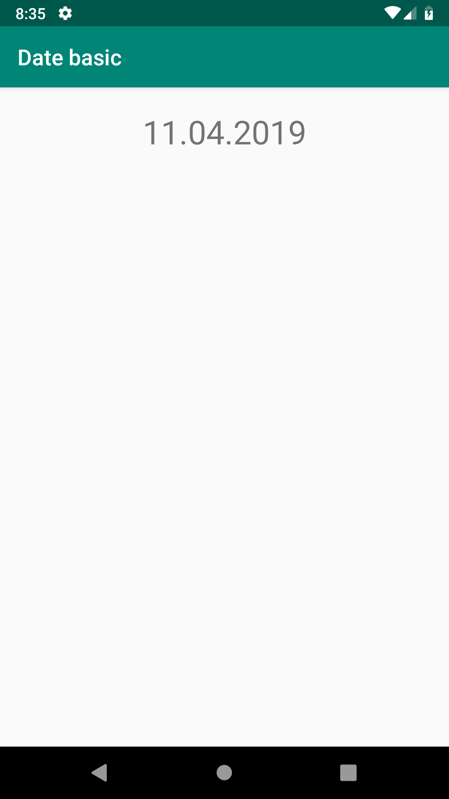


Таким образом можно использовать действия для запуска различных активностей. В данной работе мы определили собственное действие, существующее только в нашем приложении. Однако, точно таким же образом можно использовать стандартные действия, определенные самой системой для выполнения распространенных задач. 

Самостоятельно изучите их.
## Передача информации в интент
Теперь потренируемся передавать информацию в запущенный по интенту компонент. Для этого создадим поле для текстового ввода в схеме главного окна:
```java
<LinearLayout
   android:layout_width="match_parent"
   android:layout_height="wrap_content">

   <TextView
       android:id="@+id/textView2"
       android:layout_width="wrap_content"
       android:layout_height="wrap_content"
       android:text="Last Name">
   </TextView>

   <EditText
       android:id="@+id/etLName"
       android:layout_width="match_parent"
       android:layout_height="wrap_content"
       android:layout_marginLeft="5dp">
   </EditText>
</LinearLayout>
```

В коде главной активности добавим необходимый код для извлечения строки из поля ввода. Теперь добавим вызов метода интента после его создания, но до старта активности по этому интенту:
``intent.putExtra("lname", etLName.getText().toString());``
Эта инструкция добавит в структуру данных интента пользовательской текстовое поле с именем "lname" и значением из нашего текстового поля. Таких полей можно добавлять сколько угодно. 

Теперь воспользуемся переданной информацией во второй активности. Создадим для нее текстовое поле:
```java
<TextView
   android:id="@+id/tvView"
   android:layout_width="wrap_content"
   android:layout_height="wrap_content"
   android:layout_gravity="center_horizontal"
   android:layout_marginTop="20dp"
   android:text="TextView"
   android:textSize="20sp">
</TextView>
```

И запишем в него информацию, извлеченную из интента:

    String lName = intent.getStringExtra("lname");
    tvView.setText("Your name is: " + lName);

Общая схема работы нашего приложения теперь выглядит так. Обращаем внимание, что мы модифицировали только активность “Info”, две остальные не получают из интена дополнительных полей (хотя они туда все равно передаются). 


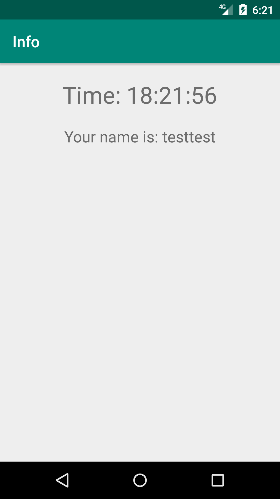

- # Возвращение результатов из интента
Часто требуется запустить активность для того, чтобы получить из нее какой-либо результат. Для этого изучим механизм возврата значения из активности. 
Добавим в главное окно надпись и кнопку, по нажатию на которую мы будем переходить в другую активность и вводить текст, а при возврате в главную активность этот текст будет отображаться. 
```xml
<LinearLayout
   xmlns:android="http://schemas.android.com/apk/res/android"
   android:layout_width="fill_parent"
   android:layout_height="fill_parent"
   android:orientation="vertical">
   <Button
       android:id="@+id/btnName"
       android:layout_width="wrap_content"
       android:layout_height="wrap_content"
       android:layout_gravity="center_horizontal"
       android:layout_margin="20dp"
       android:text="Input name">
   </Button>

   <TextView
       android:id="@+id/tvName"
       android:layout_width="wrap_content"
       android:layout_height="wrap_content"
       android:layout_gravity="center_horizontal"
       android:text="Your name is ">
   </TextView>
</LinearLayout>
```

В коде главной активности добавим в обработчик события код вызова новой активности. Обратите внимание, что мы вызываем активность при помощи другого метода.

    intent = new Intent(this, NameActivity.class);
    startActivityForResult(intent, 1);
    break;


Теперь создадим вторую активность и расположим в ней необходимые элементы для удобного ввода текста:

```xml
<LinearLayout
   xmlns:android="http://schemas.android.com/apk/res/android"
   android:layout_width="match_parent"
   android:layout_height="match_parent"
   android:orientation="vertical">

   <LinearLayout
       android:id="@+id/linearLayout1"
       android:layout_width="match_parent"
       android:layout_height="wrap_content"
       android:layout_margin="10dp">

       <TextView
           android:id="@+id/textView1"
           android:layout_width="wrap_content"
           android:layout_height="wrap_content"
           android:text="Name">
       </TextView>

       <EditText
           android:id="@+id/etName"
           android:layout_width="wrap_content"
           android:layout_height="wrap_content"
           android:layout_marginLeft="10dp"
           android:layout_weight="1">
           <requestFocus>
           </requestFocus>
       </EditText>

   </LinearLayout>
   <Button
       android:id="@+id/btnOK"
       android:layout_width="wrap_content"
       android:layout_height="wrap_content"
       android:layout_gravity="center_horizontal"
       android:text="OK">
   </Button>
</LinearLayout>
```

В коде главной активности создадим обработчик нажатия на кнопку. В нем мы создаем интент, в который поместим возвращаемую информацию. Обратите внимание на вызов 
метода finish(). 

```java
@Override
public void onClick(View v) {
   Intent intent = new Intent();
   intent.putExtra("name", etName.getText().toString());
   setResult(RESULT_OK, intent);
   finish();
}
```

Теперь возвращаемся в главную активность. Здесь мы должны определить метод, обрабатывающий обратный интент:

```java
@Override
protected void onActivityResult(int requestCode, int resultCode, Intent data) {
   if (data == null) {return;}
   String name = data.getStringExtra("name");
   tvName.setText("Your name is " + name);
}
```

Проверим работоспособность нашего приложения:

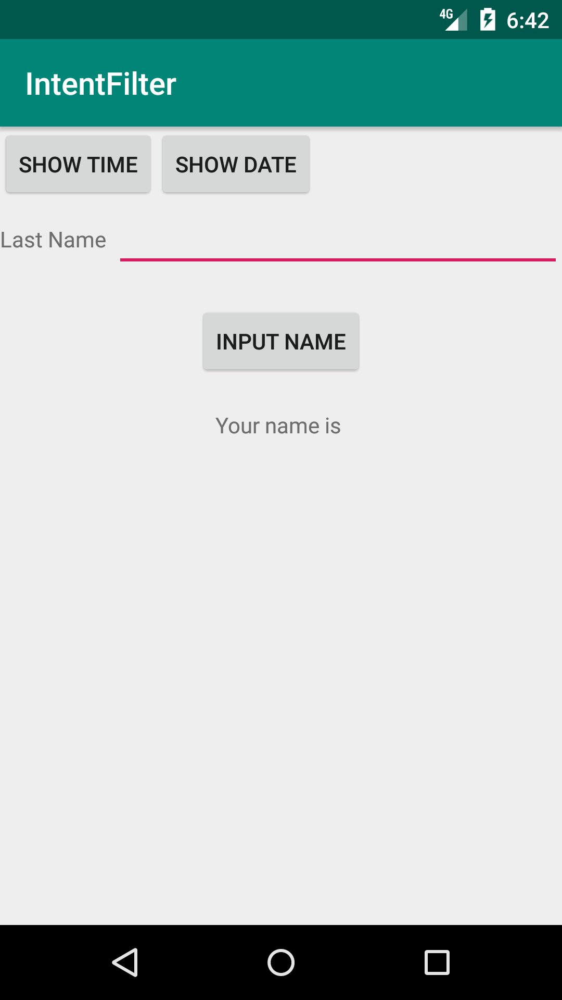

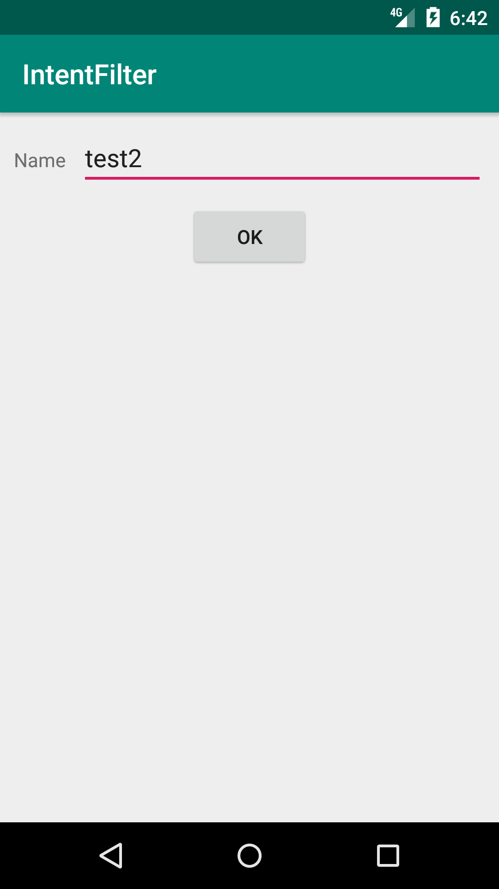

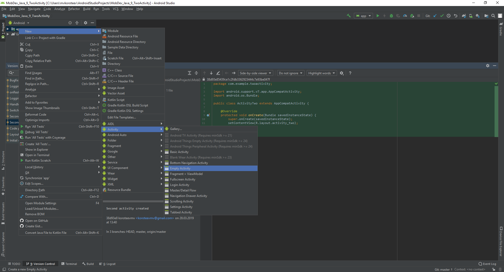


## Контрольные вопросы
Какие существуют соглашения в порядке наименования действий?

Как передать информацию в активность используя неявный вызов?

Какие еще параметры можно задавать при создании неявного интента?

Зачем нужна категория в интент-фильтрах? Какие существуют категории?

Зачем нужен элемент  <requestFocus>?

Зачем нужны аргументы requestCode и resultCode в обратном интенте?

## Дополнительные задания
Создайте приложение, на главном окне которого будет расположено поле ввода текста и при нажатии на кнопку “перейти” будет запускаться браузер по введенному пользователем адресу.

Создайте приложение, отвечающее на какое-либо стандартное системное действие. Проверьте его работоспособность.

Создайте приложение, которое выводит текстовую надпись и предлагает выбрать цвет и выравнивание надписи. Выбор должен производиться в двух разных активностях. При возврате в основную активность форматирование надписи должно меняться. 

(*) Создайте приложение, запускающее приложение камеры. Когда пользователь делает снимок, он должен вернуться в наше приложение, и оно должно отобразить его в виде миниатюры на экране.

- # Практика: Возврат результата	
	Видео		https://www.youtube.com/watch?v=fVqwsoTCoUU
- # Практика: Использование системных активностей
	Видео		https://www.youtube.com/watch?v=EK1m0O0UEQw
- # Практика: Работа с действием Send		
    Видео	https://www.youtube.com/watch?v=xUCXJmnBToM

- # Работа с графическими элементами

Цель работы

    Освоить работу с базовыми визуальными элементами Android Studio и
    способы организации архитектуры приложения на Android.

## Задание

На основе лабораторных работ «MD1.1 Основные элементы» и «MD2.2
Фильтры намерений» реализуйте приложение «Список дел», состоящее из
нескольких экранов. На главном экране реализована навигация по
существующим категориям. 
При переходе на каждую категорию
реализовать возможность добавления новых дел.

При оформлении приложения не оставляйте стандартного оформления,
поменяйте цвета навигации.

Также поменяйте иконку приложения.
Создать иконку можно в Figma (512 х 512 px): https://www.figma.com/

Для того чтобы добавить своё изображение в проект, в
программе Android Studio, в каталоге Вашего проекта, найдите
путь: app &gt; src &gt; res и вызовите контекстное меню (правой кнопкой
мыши):

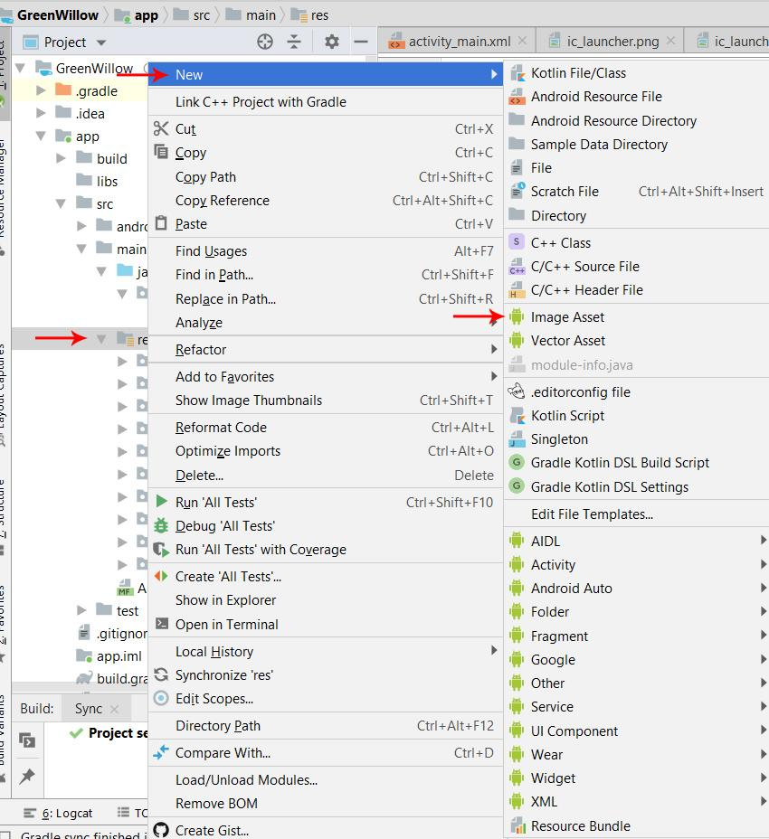

Здесь, как можно увидеть на скриншоте, мы выбираем: New > Image Asset. И попадаем во вкладку, где необходимо указать путь к изображению, задать ему имя и выбрать тип (в нашем случае Image):


Изображение, это файл с расширением *.png, с разрешением 512х512 точек. Для примера, я взял png с разрешением 256х256, чтобы можно было почувствовать разницу. После чего нажимаем Next.


После чего мы видим сообщение о том, что будет заменено текущее изображение загрузчика.

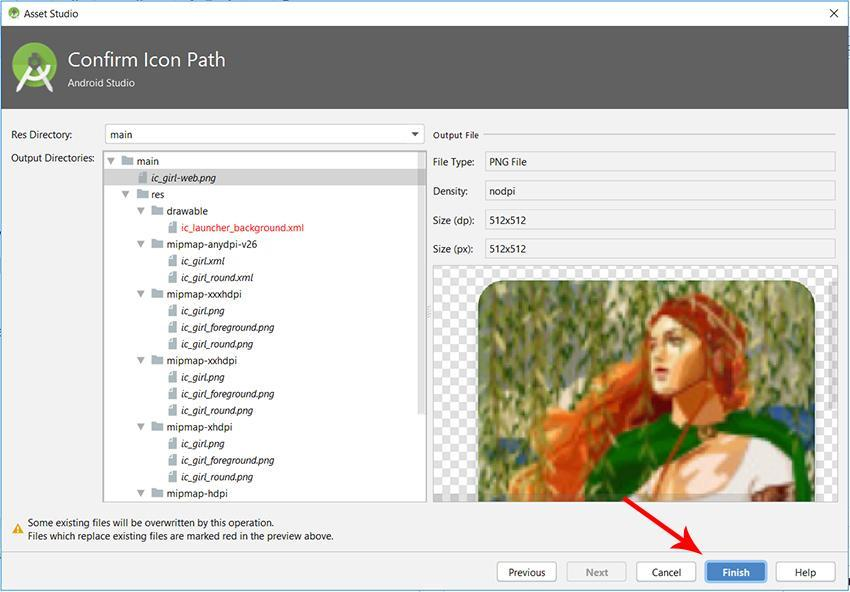

Кстати текущее изображение, можно загрузить и на рабочую область.

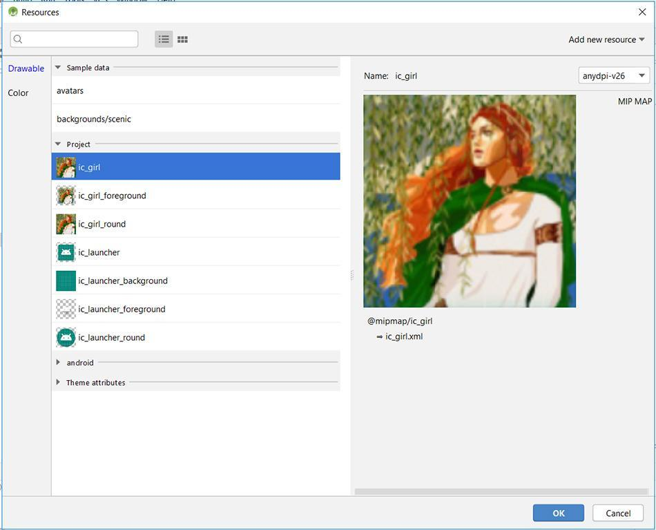

Здесь как раз отчётливо видна разница между изображениями 256х256 и 512х512.

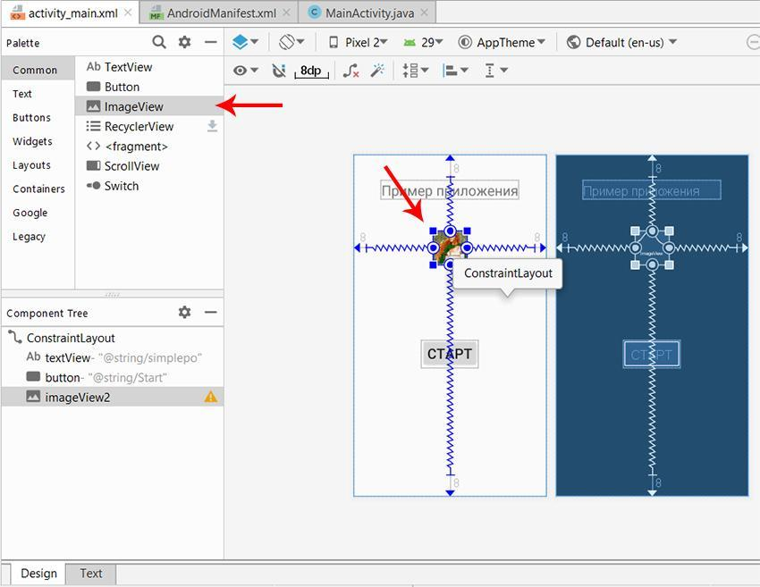

 И кстати, если Вам необходимо добавить изображение для Вашего проекта, то выбрав New > Image Asset, укажите панель Action Bar and Tab Icons.

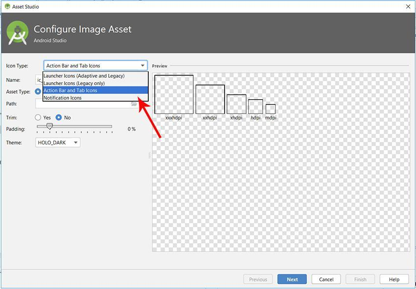

## Контрольные вопросы
1. Что такое событийно-ориентированное программирование?
2. Какие события вы использовали в своем приложении?
3. С помощью какого класса предоставляется доступ к ресурсам из кода Java?
4. Какие основные квалификаторы ресурсов вы знаете?
5. Какие основные XML-атрибуты используются для задания расположения виджета на экране?
6. Какие основные XML-атрибуты используются для задания отображения виджета на экране?
7. Какие существуют соглашения в порядке наименования действий?
8. Как передать информацию в активность используя неявный вызов?
9. Какие еще параметры можно задавать при создании неявного интента?
10. Зачем нужна категория в интент-фильтрах? Какие существуют категории?
11. Зачем нужен элемент  <requestFocus>?
12. Зачем нужны аргументы requestCode и resultCode в обратном интенте?
13. Зачем делить приложение на несколько окно? Почему нельзя использовать разные расположения?
14. Что такое интент и зачем он нужен?
15. Как вызвать определенное окно своего приложение? А другого?
16. Что такое таск? Почему при перемещении между окнами работает кнопка “Назад”?

## Дополнительные задания
1. Создайте приложение, на главном окне которого будет расположено поле ввода текста и при нажатии на кнопку “перейти” будет запускаться браузер по введенному пользователем адресу.
2. Создайте приложение, отвечающее на какое-либо стандартное системное действие. Проверьте его работоспособность.
3. Создайте приложение, которое выводит текстовую надпись и предлагает выбрать цвет и выравнивание надписи. Выбор должен производиться в двух разных активностях. При возврате в основную активность форматирование надписи должно меняться. 
4. (*) Создайте приложение, запускающее приложение камеры. Когда пользователь делает снимок, он должен вернуться в наше приложение, и оно должно отобразить его в виде миниатюры на экране.

- # Создание главного меню приложения

Цель работы

    Познакомиться с инструментами и приемами создания меню мобильного приложения и способами взаимодействия с ним.

## Методические указания
Простое меню

Откроем MainActivity.java. За создание меню отвечает метод onCreateOptionsMenu. На вход ему подается объект типа Menu, в который мы и будем добавлять свои пункты.
Добавьте в Activity этот метод:
```java
public boolean onCreateOptionsMenu(Menu menu) {
  // TODO Auto-generated method stub
   
  menu.add("menu1");
  menu.add("menu2");
  menu.add("menu3");
  menu.add("menu4");
   
  return super.onCreateOptionsMenu(menu);
}
```

Пункты меню добавляются методом add. На вход методу подается текст пункта меню. Добавим 4 пункта.
Метод onCreateOptionsMenu должен вернуть результат типа boolean. True – меню показывать, False – не показывать. Т.е. можно было бы накодить проверку какого-либо условия, и по итогам этой проверки не показывать меню передавая False. Пока нам это не нужно, поэтому поручаем этот выбор методу суперкласса, по умолчанию он возвращает True.

## Создание обработчика нажатия

Появилось 4 пункта меню. Нажатие на них ни к чему не приводит, т.к. не реализован обработчик. Обработчиком является Activity, а метод зовется onOptionsItemSelected. На вход ему передается пункт меню, который был нажат – MenuItem. Определить, какое именно меню было нажато можно по методу getTitle. Давайте выводить всплывающее сообщение с текстом нажатого пункта меню. На выходе метода надо возвращать boolean. И мы снова предоставляем это суперклассу.
```java
public boolean onOptionsItemSelected(MenuItem item) {
  // TODO Auto-generated method stub
  Toast.makeText(this, item.getTitle(), Toast.LENGTH_SHORT).show();
  return super.onOptionsItemSelected(item);
}
```

Определять нажатый пункт меню по тексту – это не самый лучший вариант. Далее будем делать это по ID. Но для этого надо немного по другому создавать меню.

## Меню с группировками
Рассмотрим другую реализацию этого метода - add(int groupId, int itemId, int order, CharSequence title). У этого метода 4 параметра на вход: 
- groupId - идентификатор группы, частью которой является пункт меню
- itemId - ID пункта меню
- order - для задания последовательности показа пунктов меню
- title - текст, который будет отображен
Чтоб показать как используются все эти параметры, создадим приложение. На экране будет TextView и CheckBox:
- TextView будет отображать какой пункт меню был выбран
- CheckBox будет определять показывать обычное меню или расширенное. Это будет реализовано с помощью групп меню.
Откроем main.xml, присвоим ID существующему TextView, сотрем его текст и создадим CheckBox. Код:
```xml
<?xml version="1.0" encoding="utf-8"?>
<LinearLayout
    xmlns:android="http://schemas.android.com/apk/res/android"
    android:orientation="vertical"
    android:layout_width="fill_parent"
    android:layout_height="fill_parent">
    <CheckBox
        android:layout_width="wrap_content"
        android:layout_height="wrap_content"
        android:id="@+id/chbExtMenu"
        android:text="расширенное меню">
    </CheckBox>
    <TextView
        android:layout_width="fill_parent"
        android:layout_height="wrap_content"
        android:id="@+id/textView">
    </TextView>
</LinearLayout>
```

Открываем MainActivity.java и класс MainActivity заполняем следующим кодом:
```java
public class MainActivity extends Activity {
   
  // Элементы экрана
  TextView tv;
  CheckBox chb;
   
   
    /** Called when the activity is first created. */
    @Override
    public void onCreate(Bundle savedInstanceState) {
        super.onCreate(savedInstanceState);
        setContentView(R.layout.main);
        // находим элементы
        tv = (TextView) findViewById(R.id.textView);
        chb = (CheckBox) findViewById(R.id.chbExtMenu);
         
    }
     
    // создание меню
    @Override
    public boolean onCreateOptionsMenu(Menu menu) {
      // TODO Auto-generated method stub
      // добавляем пункты меню
      menu.add(0, 1, 0, "add");
      menu.add(0, 2, 0, "edit");
      menu.add(0, 3, 3, "delete");
      menu.add(1, 4, 1, "copy");
      menu.add(1, 5, 2, "paste");
      menu.add(1, 6, 4, "exit");
       
      return super.onCreateOptionsMenu(menu);
    }
     
    // обновление меню
    @Override
    public boolean onPrepareOptionsMenu(Menu menu) {
      // TODO Auto-generated method stub
      // пункты меню с ID группы = 1 видны, если в CheckBox стоит галка
      menu.setGroupVisible(1, chb.isChecked());
      return super.onPrepareOptionsMenu(menu);
    }
 
    // обработка нажатий
    @Override
    public boolean onOptionsItemSelected(MenuItem item) {
      // TODO Auto-generated method stub
      StringBuilder sb = new StringBuilder();
 
      // Выведем в TextView информацию о нажатом пункте меню 
      sb.append("Item Menu");
      sb.append("\r\n groupId: " + String.valueOf(item.getGroupId()));
      sb.append("\r\n itemId: " + String.valueOf(item.getItemId()));
      sb.append("\r\n order: " + String.valueOf(item.getOrder()));
      sb.append("\r\n title: " + item.getTitle());
      tv.setText(sb.toString());
       
      return super.onOptionsItemSelected(item);
    }
} 
```

Давайте разбирать написанное. Мы используем следующие методы:

- onCreateOptionsMenu - вызывается только при первом показе меню. Создает меню и более не используется. Здесь мы добавляем к меню пункты.
- onPrepareOptionsMenu - вызывается каждый раз перед отображением меню. Здесь мы вносим изменения в уже созданное меню, если это необходимо
- onOptionsItemSelected - вызывается при нажатии пункта меню. Здесь мы определяем какой пункт меню был нажат.

В методе onCreateOptionsMenu мы добавляем 6 пунктов меню. Обратим внимание на параметры метода Add.
- Первый параметр – ID группы. В первых трех пунктах он равен нулю, в оставшихся трех – 1. Т.е. пункты меню copy, paste и exit объединены в группу с ID = 1. Визуально это никак не проявляется - они не отличаются цветом или еще чем-либо. ID группы мы будем использовать в реализации onPrepareOptionsMenu.
- Второй параметр – ID пункта меню. В обработчике используется для определения какой пункт меню был нажат. Будем использовать его в onOptionsItemSelected.
- Третий параметр – определяет позицию пункта меню. Этот параметр используется для определения порядка пунктов при отображении меню. Используется сортировка по возрастанию, т.е. от меньшего order к большему.
- Четвертый параметр – текст, который будет отображаться на пункте меню. 

В метод onPrepareOptionsMenu передается объект Menu и мы можем работать с ним. В данном примере вызываем setGroupVisible. Этот метод позволяет скрывать\отображать пункты меню. На вход подается два параметра – ID группы и boolean-значение. В качестве ID группы мы пишем – 1 (та самая группа с ID = 1, в которой находятся пункты copy, paste и exit), а в качестве boolean параметра используем состояние CheckBox. Если он включен, то пункты меню (из группы с ID = 1) будут отображаться, если выключен – не будут.

В зависимости от состояния CheckBox в меню видно 3 или 6 пунктов.

Обратите внимание на порядок пунктов. Они отсортированы по параметру order по возрастанию. Если order у нескольких пунктов совпадает, то эти пункты размещаются в порядке их создания в методе onCreateOptionsMenu.

При нажатии на какой-либо пункт меню срабатывает метод onOptionsItemSelected. В нем мы выводим в TextView информацию о нажатом пункте. Можете сверить эту информацию с тем, что мы кодили при создании пунктов меню. Все параметры должны совпадать. Порядок, для удобства, я сделал такой же как и в методе add: groupId, itemId, order, title.
## Создание меню в отдельном файле
Есть еще один, более удобный и предпочтительный способ создания меню - с использованием xml-файлов, аналогично layout-файлам при создании экрана. Чтобы получить меню, которые мы создавали программно на этом уроке, надо создать в папке res/menu файл mymenu.xml:
```xml
<?xml version="1.0" encoding="utf-8"?>
<menu
    xmlns:android="http://schemas.android.com/apk/res/android">
    <item
        android:id="@+id/menu_add"
        android:title="add">
    </item>
    <item
        android:id="@+id/menu_edit"
        android:title="edit">
    </item>
    <item
        android:id="@+id/menu_delete"
        android:orderInCategory="3"
        android:title="delete">
    </item>
    <group
        android:id="@+id/group1">
        <item
            android:id="@+id/menu_copy"
            android:orderInCategory="1"
            android:title="copy">
        </item>
        <item
            android:id="@+id/menu_paste"
            android:orderInCategory="2"
            android:title="paste">
        </item>
        <item
            android:id="@+id/menu_exit"
            android:orderInCategory="4"
            android:title="exit">
        </item>
    </group>
</menu>
```

Если в папке res нет папки меню, создайте ее. Правой кнопкой на res, выбирайте New > Android Resource Directory, в Resource type выбирайте menu и жмите OK.

item - это пункт меню, group - группа. В атрибутах ID используем ту же схему, что и в ID экранных компонентов, т.е. пишем \@+id/<your_ID> и Eclipse сам создаст эти ID в R.java. Атрибут orderInCategory - это порядок пунктов, а title - текст.

В методе onCreateOptionsMenu нам теперь не надо вручную кодить создание каждого пункта, мы просто свяжем menu, который нам дается на вход и наш xml-файл. 

    public boolean onCreateOptionsMenu(Menu menu) {
    getMenuInflater().inflate(R.menu.mymenu, menu);
    return super.onCreateOptionsMenu(menu);
    }
С помощью метода getMenuInflater мы получаем MenuInflater и вызываем его метод inflate. На вход передаем наш файл mymenu.xml из папки res/menu и объект menu. MenuInflater берет объект menu и наполняет его пунктами согласно файлу mymenu.xml.

Если захотите скрыть группу, выполняете тот же метод setGroupVisible и передаете туда R.id.group1 в качестве ID группы.
## Дополнительные задания
Попробуйте добавить еще несколько пунктов в меню, чтобы их стало больше шести. И обратите внимание, как они отобразятся.

Реализуйте меню с пунктом “выход”, при выборе которого приложение должно закрыться.

Модифицируйте игру “Угадай число” таким образом, чтобы в меню можно было выбирать уровень сложности, начинать новую игру и выходить из приложения.

- # Практика: Главное меню	
	Видео		https://www.youtube.com/watch?v=3pGbaWf9lt8
	
- # Практика: Всплывающее меню
	Видео		https://www.youtube.com/watch?v=0qbGA7zliac
- # Практика: ListView	
	Видео	https://www.youtube.com/watch?v=UlcGSP4OpO8

- # Создание контекстного меню
Цель работы

    Научиться создавать и использовать контекстное меню на отдельных элементах приложения
## Методические указания
Контекстное меню вызывается в Андроид длительным нажатием на каком-либо экранном компоненте. Обычно оно используется в списках, когда на экран выводится список однородных объектов (например письма в почт.ящике) и, чтобы выполнить действие с одним из этих объектов, мы вызываем контекстное меню для него. Но т.к. списки мы еще не проходили, сделаем пример попроще и будем вызывать контекстное меню для TextView.

Откроем main.xml и нарисуем там два TextView:
```xml
<?xml version="1.0" encoding="utf-8"?>
<LinearLayout
    xmlns:android="http://schemas.android.com/apk/res/android"
    android:orientation="vertical"
    android:layout_width="fill_parent"
    android:layout_height="fill_parent">
    <TextView
        android:layout_height="wrap_content"
        android:textSize="26sp"
        android:layout_width="wrap_content"
        android:id="@+id/tvColor"
        android:layout_marginBottom="50dp"
        android:layout_marginTop="50dp"
        android:text="Text color">
    </TextView>
    <TextView
        android:layout_width="fill_parent"
        android:layout_height="wrap_content"
        android:textSize="22sp"
        android:id="@+id/tvSize"
        android:text="Text size">
    </TextView>
</LinearLayout>
```

Для первого TextView мы сделаем контекстное меню, с помощью которого будем менять цвет текста. Для второго – будем менять размер текста.

Принцип создания контекстного меню похож на создание обычного меню. Но есть и отличия.

Метод создания onCreateContextMenu вызывается каждый раз перед показом меню. На вход ему передается:

- ContextMenu, в который мы будем добавлять пункты
- View - элемент экрана, для которого вызвано контекстное меню
- ContextMenu.ContextMenuInfo – содержит доп.информацию, когда контекстное меню вызвано для элемента списка. Пока мы это не используем, но, когда будем изучать списки, увидим, что штука полезная.

Метод обработки onContextItemSelected аналогичный методу onOptionsItemSelected для обычного меню. На вход передается MenuItem – пункт меню, который был нажат.

Также нам понадобится третий метод registerForContextMenu. На вход ему передается View и это означает, что для этой View необходимо создавать контекстное меню. Если не выполнить этот метод, контекстное меню для View создаваться не будет.

Давайте кодить, открываем MainActivity.java. Опишем и найдем TextView и укажем, что необходимо создавать для них контекстное меню.
TextView tvColor, tvSize;
```java 
  /** Called when the activity is first created. */
  @Override
  public void onCreate(Bundle savedInstanceState) {
      super.onCreate(savedInstanceState);
      setContentView(R.layout.main);
       
      tvColor = (TextView) findViewById(R.id.tvColor);
      tvSize = (TextView) findViewById(R.id.tvSize);
       
      // для tvColor и tvSize необходимо создавать контекстное меню
      registerForContextMenu(tvColor);
      registerForContextMenu(tvSize);
           
  }
```

Теперь опишем создание контекстных меню. Используем константы для хранения ID пунктов меню.
```
final int MENU_COLOR_RED = 1;
final int MENU_COLOR_GREEN = 2;
final int MENU_COLOR_BLUE = 3;
 
final int MENU_SIZE_22 = 4;
final int MENU_SIZE_26 = 5;
final int MENU_SIZE_30 = 6; 
```

И создаем
```java
@Override
public void onCreateContextMenu(ContextMenu menu, View v,
    ContextMenuInfo menuInfo) {
  // TODO Auto-generated method stub
  switch (v.getId()) {
case R.id.tvColor:
  menu.add(0, MENU_COLOR_RED, 0, "Red");
  menu.add(0, MENU_COLOR_GREEN, 0, "Green");
  menu.add(0, MENU_COLOR_BLUE, 0, "Blue");
  break;
case R.id.tvSize:
  menu.add(0, MENU_SIZE_22, 0, "22");
  menu.add(0, MENU_SIZE_26, 0, "26");
  menu.add(0, MENU_SIZE_30, 0, "30");
  break;
}
}
```
Обратите внимание, что мы по ID определяем View, для которого вызвано контекстное меню и в зависимости от этого создаем определенное меню. Т.е. если контекстное меню вызвано для tvColor, то мы создаем меню с перечислением цветов, а если для tvSize – с размерами шрифта.

В качестве ID пунктов мы использовали константы. Группировку и сортировку не используем, поэтому используем нули в качестве соответствующих параметров.

Можно все сохранить и запустить. При долгом нажатии на TextView должны появляться контекстные меню.
## Дополнительные задания
Создайте приложение-текстовый редактор


